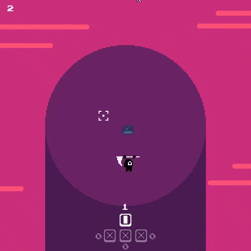

## Final Project




This is a 2d game where the objective is to kill as many slimes as possible while staying on the platform.
Falling off will result in an instant death, likewise, hitting enemies off the platform will also kill them
instantly, or you can attack them until they reach 0 health.
One attack will be bound to one directional attack at a time, you will get a random attack
in a random direction after using up the current attack.

### Dependencies

- Clang or MSVC 2015+
- CMake
- Cinder
- Catch2 (for testing)

### Start

Project must be in cinder directory within a "projects" folder

```
> cd path/to/final_project
> mkdir build
> cd build
> cmake ..
> cmake --build .
> .\final_project
```

### Controls

| Key         | Action                                                      |
|----------   |-------------------------------------------------------------|
| `w`         | Move up                                                     |
| `a`         | Move down                                                   |
| `s`         | Move left                                                   |
| `d`         | Move right                                                  |
| `arrow keys`| Attack / Start Game                                         |
